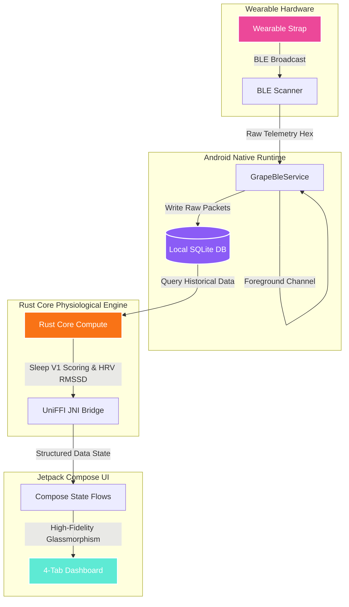

# 🍇 Grape — Performance Intelligence Platform

> **Local-First, Privacy-Focused Wearable Intelligence Engine**

Grape is an independent, client-side, local-first health and biometric analysis platform. It connects directly with wearable devices (such as WHOOP straps) via Bluetooth Low Energy (BLE), streams and archives raw biometric telemetry, and calculates advanced physiological metrics offline using an embedded high-performance Rust engine. 

No cloud backend. No remote telemetry trackers. No subscription walls. Complete ownership of your biometric data.

---

## 🏗️ System Architecture

The following diagram illustrates the local-first architecture of Grape, from raw hardware biosensor packets to the user-facing Jetpack Compose interface:



---

## ✨ Key Capabilities

* **📱 Premium Performance Aesthetics:** Designed as an elite Performance Intelligence Platform. Uses custom glassmorphic cards, vertical dark space gradients, procedural static noise overlays, and animated Canvas gauges (Recovery arc & Strain radial indicators).
* **🦀 Native Rust Physiological Engine:** High-precision sleep latency/efficiency scoring, resting heart rate checks, and RMSSD heart rate variability calculations executed directly on-device.
* **📶 Robust BLE Auto-Sync Protocol:** Runs as a dedicated Android Foreground Service that automatically detects your strap, registers active connection status, handles OTA firmware handshakes, and manages sync check-pointing.
* **📂 Local SQLite Database:** Stores raw incoming Hex frames, sync progress session structures, parsed daily heart rate metrics, and sleep stages.
* **🔒 Pure Privacy:** All data remains strictly local on your physical device. No telemetry, no external analytic endpoints, and zero cloud sync dependencies.

---

## 🎨 Visual Design Tokens & Palette

Grape features a custom, high-fidelity dark-mode interface styled to reflect premium performance engineering:

| Token | HSL / Hex | Purpose |
| :--- | :--- | :--- |
| **BackgroundPrimary** | `#05010B` | Deep base canvas |
| **BackgroundSecondary**| `#0B0816` | Intermediate layers & cards |
| **GrapePrimary** | `#8B5CF6` | Primary accents & branding |
| **GrapeAccent** | `#EC4899` | Secondary highlights & indicators |
| **CyanAccent** | `#5EEAD4` | Battery & connected status metrics |
| **RecoveryGreen** | `#22C55E` | Optimal recovery status values |
| **StressRed** | `#EF4444` | Resting warnings & Danger Zone options |

---

## 🗂️ Project Workspace Directory Layout

```text
├── app/                  # Android Jetpack Compose Mobile App
│   └── mobile/
│       ├── app/src/      # Kotlin/Compose source files & resources
│       └── build.gradle  # Gradle build scripts
├── rust/                 # Shared physiological calculations core
│   └── src/              # Sleep V1, Recovery V0, and biometric parser engine
├── ffi/                  # UniFFI bridge definitions and JNI wrappers
├── docs/                 # Detailed architectural specifications and logs
├── grape/                # Brand guidelines, assets, and vector icons
└── LICENCE               # Terms of use (Personal & Educational Use Only)
```

---

## 🛠️ Development & Building

### Prerequisites
* JDK 17+
* Android SDK (API Level 34+)
* Rust Toolchain (Targeting `aarch64-linux-android`, `x86_64-linux-android` for UniFFI JNI compiling)

### Building the Project
Navigate to the mobile app folder and trigger the Gradle build process:
```bash
cd app/mobile
./gradlew compileDebugKotlin
./gradlew assembleDebug
```
The compiled, installable APK will be output to `app/mobile/app/build/outputs/apk/debug/app-debug.apk`.

### Injecting Simulated Biometrics
For testing UI transitions, trend charts, and the physiological dashboard without hardware connections:
1. Navigate to the **Profile** tab in the app.
2. Under **Developer Mode**, click **Inject Demo Data**.
3. This writes 5 days of realistic biometric packets into the SQLite store and refreshes all metrics.

---

## 📄 License & Restrictions

This project is licensed under a restricted license. **Commercial use, redistribution, or derivation for commercial purposes is strictly prohibited.**

> [!IMPORTANT]
> Cloning, downloading, or using this codebase constitutes an agreement to the terms defined in the [LICENCE](file:///home/sugarcube/Desktop/VGPL/Grape/LICENCE) file. Access is restricted exclusively to **personal study, private learning, and educational research purposes**.

---
**Copyright © 2026 Grape Platform. All Rights Reserved.**
